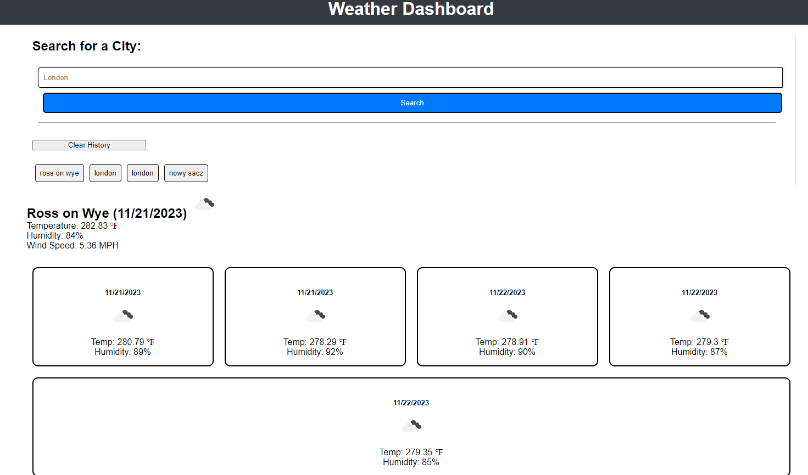

# weather-app-by-bakomans-
weather app by bakomans

## Overview

The Weather Dashboard App is a web application that allows users to check the current and 5-day forecast for multiple cities. It utilizes the OpenWeatherMap API to retrieve weather data and displays it dynamically in the browser.

## Features

- Search for weather information for any city.
- Display current weather conditions for the searched city.
- Display a 5-day forecast for the searched city.
- View a search history for quick access to previously searched cities.
- Clear search history.

## technologies used :
- HTML 5
- CSS 3
- Bootstrap
- Day.js - A minimalist JavaScript library for parsing, validating, manipulating, and formatting dates.
- jQuery - A fast, small, and feature-rich JavaScript library.
- OpenWeatherMap Api

## Photos

## Links to project 

https://github.com/bakomans/weather-app-by-bakomans-

